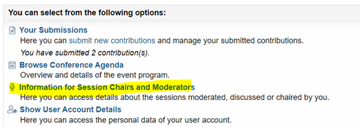

Thank you for agreeing to chair a session at the CEN 2023 Conference in Basel, Switzerland.

Please find below some guidance for chairing at the conference:

## Before the conference

* You will find the session you are assigned to in [conftool](https://www.conftool.pro/cen2023). Please log in with your registration details to check them. You will see all speakers and abstracts of the assigned sessions in this overview. You can also check the conference program on the [conference website](index.html):  

* Get in touch with your co-chair before or at the conference to discuss your roles. The email address of your co-chair is displayed in conftool under the above-stated option.
* Each session has two chairs since all sessions are run in a hybrid format. One of you will be responsible for the moderation in the room and the other one should keep an eye on the zoom chat. You can also switch roles between the talks if you are both present in the room.
* For moderating the zoom chat, a laptop that is connected to the stream will be available in the room. Alternatively, you can also connect to the stream from your phone.
* You can reach out to the speakers in advance to ask if they want to suggest one or two questions for their presentation to help with preparing the Q&A.

## At the conference

*	Arrive at the room at least 10 minutes before the start of the session so that you can check with our technical support person for any issues or outstanding items.
*	Introduce yourself to the speakers and your co-chair. Make sure that they are all aware of the session flow, including the order in which the presentations take place.
*	Double-check with the speakers how questions are asked and answered in the session. In most cases, the Q&A will follow directly after the presentation. Each speaker has 20 minutes including the Q&A. Invited, topic-contributed and featured sessions might have different rules.
*	Double-check with the speakers how they want to be reminded about the timing during their talks. It is usually easiest to sit at the front and raise your hand to do this. Alternatively, prepare paper sheets with 5 min / 2 min / 1 min warnings. Agree with your speakers in the rules before the session start so that they know what to look out for.
*	Please make sure that mics are used by the speakers and the audience if available.
*	It might be necessary to repeat questions from the audience and from virtual participants if the room setup does not allow interaction. Our technical support team will inform you about the setup.

## During the Session

* Welcome everyone and repeat the name of the session in case somebody is in the wrong place
* Describe the structure of the session (presentations followed by Q&A, panel discussion, Q&A at the end, etc.) as needed
* Mention the mic-set-up for Q&A
* Introduce the speakers (name and affiliation) before their presentation
* Time the speakers to make sure that the session time is spent fairly. If needed, remind the speakers to finish if they get close to the end of their allotted time. 
* Once the speakers have finished their talk, stand up and invite the audience to ask questions, if time allows. If the time slot for the presentation is exhausted (usually after 20 min), no further questions should be allowed. Liaise with your co-chair regarding the virtual participants. If there aren’t any questions ask one to start the discussion. 
* At the end of the session, thank all speakers and the audience.

