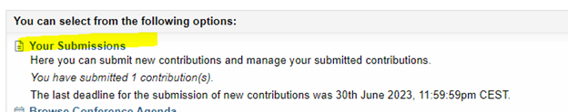
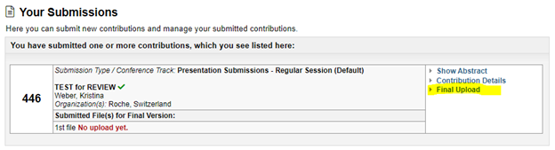

Thank you for agreeing to speak at the CEN 2023 Conference in Basel, Switzerland. 
Please find below some guidance for creating and submitting your presentation for the conference:

## Session time
If you want to know your session date and time then visit the [schedule](https://www.conftool.pro/cen2023/sessions.php) online.

## Presentation Format
*	Your presentation should be in a <b>PowerPoint (pptx)</b> or <b>PDF></b> file format. No other formats (e.g. Excel, Word or Prezi) will be accepted. 
*	All presentations will be projected in 16:9 format landscape (not 4:3) using the provided Powerpoint or PDF file on a Windows laptop.
*	All presentations must be in English followed by Questions & Answers in English.
*	Keynote will not be supported because it cannot be played back on a Windows PC. Please export your presentation as MS Office 365, using filename extension ‘.pptx’.
*	Clearly <b>identify your presentation</b> with your presentation date and name in the filename (example: 04SEP23_John_Smith.pptx)
*	The <b>maximum file size is 10 megabytes</b>.

### Presentation Design Recommendations
*	Use high contrast colours; light text on dark background or vice versa.
*	Hyperlinks to external content such as websites cannot be supported.

## Submitting your presentation
* <b>Please submit your presentation within your [conftool](https://www.conftool.pro/cen2023/index.php?page=login) account no later than Wednesday, 30th of August.</b>
*	We <b><u>cannot</u></b> accept USB sticks or files via email at the conference.
*	If you want to update your presentation, you can upload a new file the same way the first one was uploaded, but no later than 30th August.

### Upload Instructions
* When logging into conftool you can click on “Your Submission” to see your submission:  
    
    
*	Then click on final upload:  
    
    
*	After choosing your file please upload and save the data.  
    
  
  

## At the conference

*	Speakers should arrive in the session room 10 minutes before the session is due to start. Please introduce yourself to the session Chairs. Be aware of the time for your presentation.
*	A technician will be present in each session room to assist speakers in accessing their respective presentations.
*	All presentations will be controlled by the respective presenter from the lectern.
*	A microphone will be used for all presentations. 
*	You will not be able to use a laser pointer since the conference is held hybrid and virtual attendees can’t see the laser pointer. If you need to point to anything in your presentation you have to use the pointer within Powerpoint. Please get familiar with this before the conference.

