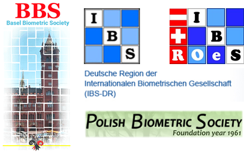

# Save the date

CEN2023 will be the $6^\text{th}$ Conference of the [Central European Network](https://www.biometricsociety.org/about/regions-networks/central-european-network) and take place from   
<b> 3-7 September, 2023, at the [Biozentrum](https://www.biozentrum.unibas.ch) in [Basel](https://www.basel.com), Switzerland</b>.

CEN2023 is a joint conference of

* the [Austro-Swiss Region (ROeS)](https://www.ibs-roes.org),
* the [German Region (DR)](http://www.biometrische-gesellschaft.de) and
* the [Polish Region](https://sparrow.up.poznan.pl/polbiom/index.php?lang=en)

of the [International Biometric Society (IBS)](https://www.biometricsociety.org) and supported by the [Basel Biometric society (BBS)](https://baselbiometrics.github.io/home/docs/index.html):

{width=50%}

# Contact information
The local organizing team is currently being assembled:
[Contact us](mailto:organizers@cen2023.ch)

