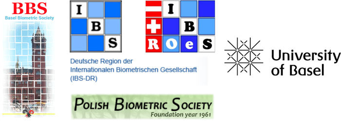
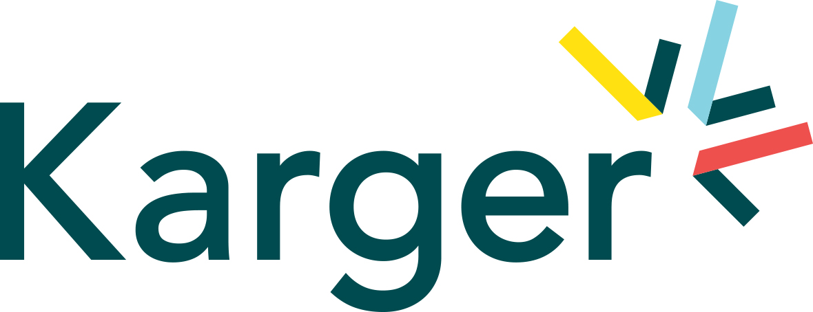
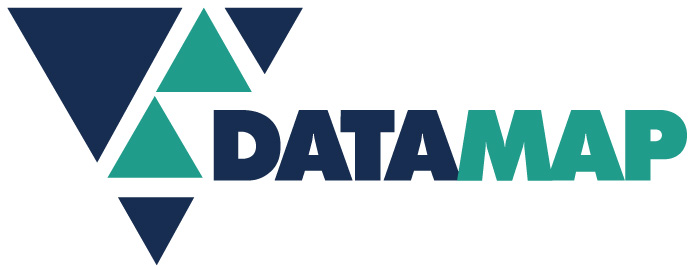

 

::: {#hello .greeting .message style="background-color: #F0F0F0; margin-top: 10px; padding-top: 10px; padding-left: 15px; padding-right: 15px; padding-bottom: 5px; margin-bottom: 10px; font-weight:bold;"}
# Latest News

Now available and/or updated:

* [Confirmed sessions](sessions.html)
* [Keynote & invited speakers](speakers.html)
* [Courses](courses.html)
* [Accommodation information and SPAM WARNING](accommodation.html) 
* [Conference venue details](venue.html) 

The submission of abstracts for talks and posters is now closed.
:::

 

# CEN2023 Conference

 The 5th Conference of the [Central European Network](https://www.biometricsociety.org/about/regions-networks/central-european-network) will take place from   <b> 3-7 September, 2023, at the [Biozentrum](https://www.biozentrum.unibas.ch) of the [University](https://www.unibas.ch/en) of [Basel](https://www.basel.com), Switzerland</b>. 

The conference theme “From Data to Knowledge. Advancing Life Sciences.” highlights the special and important role played by biometricians (statisticians and data scientists) when extracting knowledge from data with the ultimate goal of advancing life sciences. The goal of CEN2023 is to present and discuss recent developments in biometry with its applications in life sciences, medicine, pharmacology, research and development in pharmaceutical industry, environmental statistics, and genomics (see the [full list of topics](topics.html)).

 

::: {#hello .greeting .message style="background-color: #F0F0F0; margin-top: 10px; padding-top: 10px; padding-left: 15px; padding-right: 15px; padding-bottom: 5px; margin-bottom: 10px; "}
<h4>[Featured sessions:](sessions.html)</h4>

- Best practices for Data Monitoring Committees and how to get there
- Biometrical Journal Showcase - Editor’s Selection	
- Industry meets academia: Session in memory of Dieter Hauschke
- Statistics in Practice: Simulation studies as a tool to evaluate and compare the properties of statistical methods – an overview
- Ten years of the STRengthening Analytical Thinking for Observational Studies (STRATOS) initiative – progress and looking to the future
:::

 

CEN2023 is a joint conference of

-   the [Austro-Swiss Region (ROeS)](https://www.ibs-roes.org),
-   the [German Region (DR)](http://www.biometrische-gesellschaft.de) and
-   the [Polish Region](https://ptb.up.poznan.pl/en/)
<!-- (https://sparrow.up.poznan.pl/polbiom/index.php?lang=en) -->

of the [International Biometric Society (IBS)](https://www.biometricsociety.org) and supported by the [Basel Biometric society (BBS)](https://baselbiometrics.github.io/home/docs/index.html)

This year, we offer the possibility for ‘tandem talks’ regarding biostatistics for joint presentations at CEN2023 and the [GMDS 2023](https://www.gmds2023.de/en/) conference in Heilbronn.

 

{width="80%"}

 
 

# Thank you to our sponsors

### Platinum Sponsors
<a href="https://www.novartis.com/">{width="25%"}</a>
&nbsp;&nbsp;&nbsp;&nbsp;&nbsp;&nbsp;
 
 

### Gold Sponsors
<a href="https://www.karger.com/">{width="25%"}</a>
&nbsp;&nbsp;&nbsp;&nbsp;&nbsp;&nbsp;
<a href="https://www.datamap.de/">{width="25%"}</a>
&nbsp;&nbsp;&nbsp;&nbsp;&nbsp;&nbsp;
<a href="https://www.boehringer-ingelheim.com/">{width="25%"}</a>
 
 
<a href="https://posit.co/">{width="25%"}</a>
&nbsp;&nbsp;&nbsp;&nbsp;&nbsp;&nbsp;
<a href="https://www.sfa-phrt.ch/">{width="35%"}</a>

 
 

<!-- ### Silver Sponsors -->

# Contact information

[Contact us](mailto:organizers@cen2023.ch)

