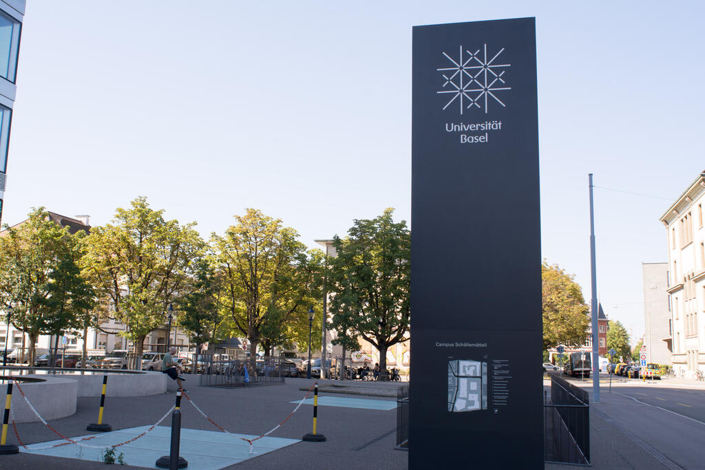
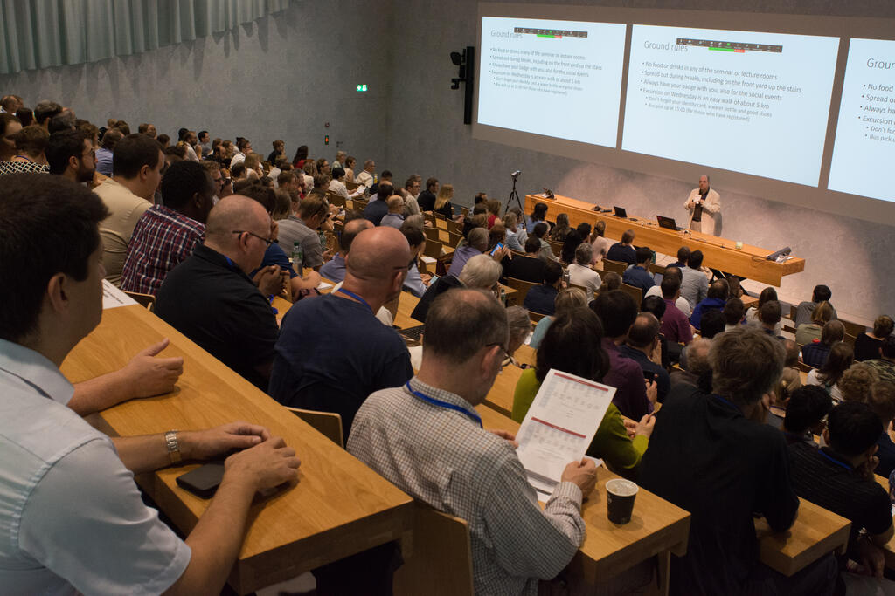
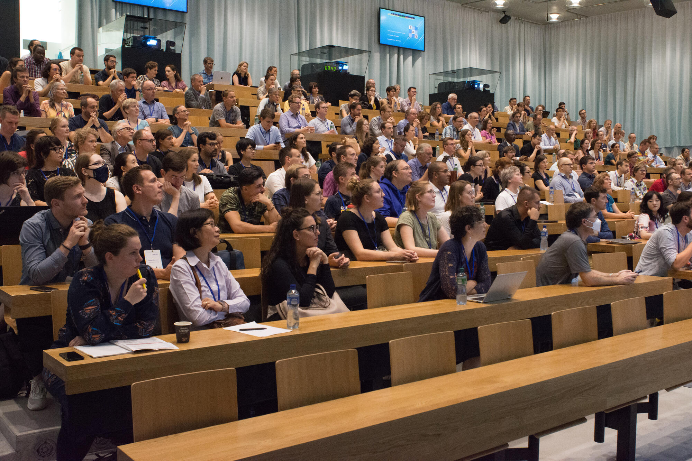
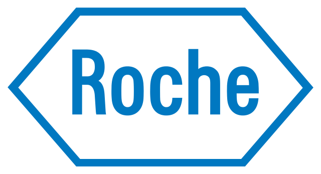
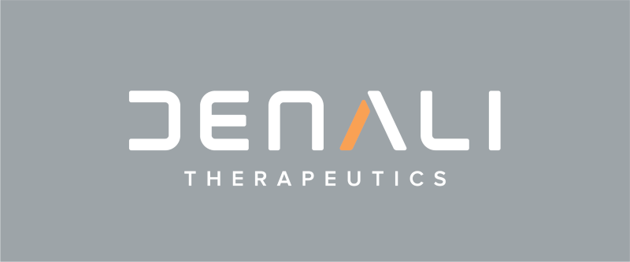
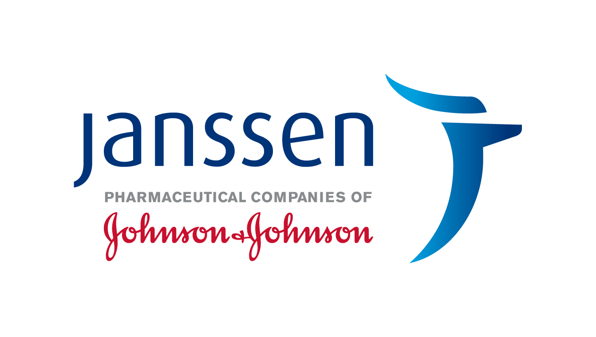
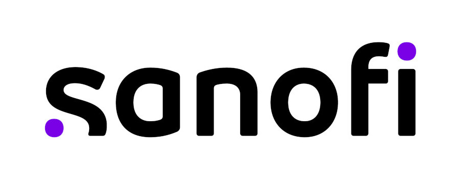

 

  
  
  
  
  

  
  
    
  
  
  
  
  
  
  
  
  
    

::: {#hello .greeting .message style="background-color: #F0F0F0; margin-top: 10px; padding-top: 10px; padding-left: 15px; padding-right: 15px; padding-bottom: 5px; margin-bottom: 10px; font-weight:bold;"}
# Latest News
Thank you again for contributing to the success of the CEN2023 conference in Basel! We are incredibly grateful to all our conference attendees, inspirational speakers, generous sponsors, student helpers and volunteers – everybody played a vital role in making this conference a success!

If you want to remember the enjoyable moments, please browse through the selection of pictures from the conference above, or through the [full gallery](gallery/index.html).

Please be reminded that the Biometrical Journal will publish a Special Issue related to CEN2023. Upon multiple requests, the deadline for submission has been extended to January 15, 2024. Further details are available [here](https://onlinelibrary.wiley.com/page/journal/15214036/homepage/call_for_papers.html#CEN2023).

The slides for the CEN 2023 conference are now [available on conftool after logging in](https://www.conftool.pro/cen2023/). We would like to emphasize that the availability of the slides is subject to the presenter's consent. We greatly appreciate the willingness of these presenters to contribute to the knowledge sharing within our conference community.

In addition, [all video recordings of the keynotes are now also available](speakers.html).

The final <b>[conference schedule](data/ConferenceSchedule%201.1.pdf)</b> and <b>[conference book](data/ConferenceBook%201.1.pdf) are available, as is the browsable <b>[conference program](https://www.conftool.pro/cen2023/sessions.php)</b>. 
:::

<link rel="stylesheet" href="photoswipe/dist/photoswipe.css">

 

# CEN2023 Conference

 The 5th Conference of the [Central European Network](https://www.biometricsociety.org/about/regions-networks/central-european-network)  took place from   <b> 3-7 September, 2023, at the [Biozentrum](https://www.biozentrum.unibas.ch) of the [University](https://www.unibas.ch/en) of [Basel](https://www.basel.com), Switzerland</b>. 

The conference theme "From Data to Knowledge. Advancing Life Sciences." highlights the special and important role played by biometricians (statisticians and data scientists) when extracting knowledge from data with the ultimate goal of advancing life sciences. The goal of CEN2023 is to present and discuss recent developments in biometry with its applications in life sciences, medicine, pharmacology, research and development in pharmaceutical industry, environmental statistics, and genomics (see the [full list of topics](topics.html)).

 

::: {.greeting .message style="background-color: #F0F0F0; margin-top: 10px; padding-top: 10px; padding-left: 15px; padding-right: 15px; padding-bottom: 5px; margin-bottom: 10px; "}
<h4>[Featured sessions:](sessions.html#Featured_Sessions)</h4>

-   Best practices for Data Monitoring Committees and how to get there
-   Biometrical Journal Showcase - Editor's Selection
-   Industry meets academia: Session in memory of Dieter Hauschke
-   Statistics in Practice: Simulation studies as a tool to evaluate and compare the properties of statistical methods -- an overview
-   Young Statisticians Sessions and Panel Discussion

<h4>[Satellite symposium:](sessions.html#Satellite_Symposium)</h4>

-   Ten years of the STRengthening Analytical Thinking for Observational Studies (STRATOS) initiative -- progress and looking to the future
:::

 

CEN2023 is a joint conference of

-   the [Austro-Swiss Region (ROeS)](https://www.ibs-roes.org),
-   the [German Region (DR)](http://www.biometrische-gesellschaft.de) and
-   the [Polish Region](https://ptb.up.poznan.pl/en/) <!-- (https://sparrow.up.poznan.pl/polbiom/index.php?lang=en) -->

of the [International Biometric Society (IBS)](https://www.biometricsociety.org) and supported by the [Basel Biometric society (BBS)](https://baselbiometrics.github.io/home/docs/index.html)

This year, we offer the possibility for 'tandem talks' regarding biostatistics for joint presentations at CEN2023 and the [GMDS 2023](https://www.gmds2023.de/en/) conference in Heilbronn.

 

{width="80%"}

   

# Thank you to our sponsors and funding bodies

### Platinum Partners

<a href="https://www.novartis.com/">{width="25%"}</a>            <a href="https://www.cytel.com/">{width="20%"}</a>              <a href="https://www.snf.ch/">{width="25%"}</a>                 <a href="https://www.basel.com/">{width="22%"}</a>        <a href="https://www.springer.com/">{width="25%"}</a>           <a href="https://www.roche.com/">{width="22%"}</a>          <a href="https://www.amgen.com/">{width="22%"}</a>               

### Gold Partners

<a href="https://www.karger.com/">{width="25%"}</a>                <a href="https://www.datamap.de/">{width="25%"}</a>                <a href="https://www.boehringer-ingelheim.com/">{width="25%"}</a>     <a href="https://posit.co/">{width="25%"}</a>        <a href="https://www.sfa-phrt.ch/">{width="35%"}</a>   <a href="https://www.beigene.com/">{width="25%"}</a>     <a href="https://www.denalitherapeutics.com/">{width="25%"}</a>               <a href="https://www.bms.com/">{width="25%"}</a>                   <a href="https://www.janssen.com/">{width="25%"}</a>   <a href="https://www.sanofi.com/">{width="25%"}</a>          

### Silver Partners

<a href="https://www.routledge.com/go/crc-press">{width="25%"}</a>      

# Contact information

[Contact us](mailto:organizers@cen2023.ch)
