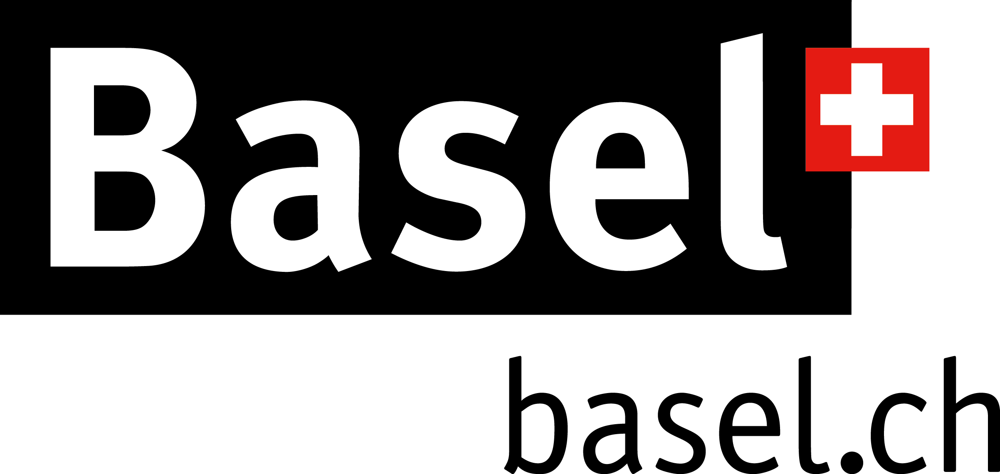
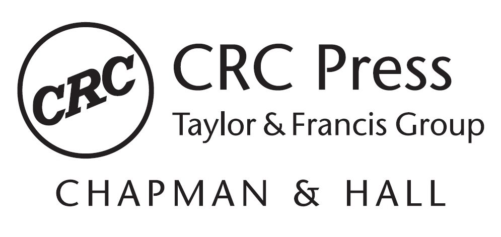

 

::: {#hello .greeting .message style="background-color: #F0F0F0; margin-top: 10px; padding-top: 10px; padding-left: 15px; padding-right: 15px; padding-bottom: 5px; margin-bottom: 10px; font-weight:bold;"}
# Latest News
The full <b>[conference program](https://www.conftool.pro/cen2023/sessions.php)</b> is now available!

The early-bird registration window has expired and in-person tickets have now sold out! Registration for virtual participation is [still available](registration.html).  

The Biometrical Journal will publish a Special Issue related to CEN2023. Deadline for submission is December 15, 2023. Further details are available [here](https://onlinelibrary.wiley.com/page/journal/15214036/homepage/call_for_papers.html#CEN2023).

There is a link for [booking additional accomodation options](accommodation.html) available now, as well as information on [childcare](childcare.html) and [Basel](about-basel.html). Please be aware of the [SPAM WARNING on the accommodation information page.](accommodation.html) 

:::

 

# CEN2023 Conference

 The 5th Conference of the [Central European Network](https://www.biometricsociety.org/about/regions-networks/central-european-network) will take place from   <b> 3-7 September, 2023, at the [Biozentrum](https://www.biozentrum.unibas.ch) of the [University](https://www.unibas.ch/en) of [Basel](https://www.basel.com), Switzerland</b>. 

The conference theme “From Data to Knowledge. Advancing Life Sciences.” highlights the special and important role played by biometricians (statisticians and data scientists) when extracting knowledge from data with the ultimate goal of advancing life sciences. The goal of CEN2023 is to present and discuss recent developments in biometry with its applications in life sciences, medicine, pharmacology, research and development in pharmaceutical industry, environmental statistics, and genomics (see the [full list of topics](topics.html)).

 

::: {#hello .greeting .message style="background-color: #F0F0F0; margin-top: 10px; padding-top: 10px; padding-left: 15px; padding-right: 15px; padding-bottom: 5px; margin-bottom: 10px; "}
<h4>[Featured sessions:](sessions.html#Featured_Sessions)</h4>

- Best practices for Data Monitoring Committees and how to get there
- Biometrical Journal Showcase - Editor’s Selection	
- Industry meets academia: Session in memory of Dieter Hauschke
- Statistics in Practice: Simulation studies as a tool to evaluate and compare the properties of statistical methods – an overview
- Young Statisticians Sessions and Panel Discussion

<h4>[Satellite symposium:](sessions.html#Satellite_Symposium)</h4>

- Ten years of the STRengthening Analytical Thinking for Observational Studies (STRATOS) initiative – progress and looking to the future
:::

 

CEN2023 is a joint conference of

-   the [Austro-Swiss Region (ROeS)](https://www.ibs-roes.org),
-   the [German Region (DR)](http://www.biometrische-gesellschaft.de) and
-   the [Polish Region](https://ptb.up.poznan.pl/en/)
<!-- (https://sparrow.up.poznan.pl/polbiom/index.php?lang=en) -->

of the [International Biometric Society (IBS)](https://www.biometricsociety.org) and supported by the [Basel Biometric society (BBS)](https://baselbiometrics.github.io/home/docs/index.html)

This year, we offer the possibility for ‘tandem talks’ regarding biostatistics for joint presentations at CEN2023 and the [GMDS 2023](https://www.gmds2023.de/en/) conference in Heilbronn.

 

{width="80%"}

 
 

# Thank you to our sponsors and funding bodies

### Platinum Partners
<a href="https://www.novartis.com/">{width="25%"}</a>
&nbsp;&nbsp;&nbsp;&nbsp;&nbsp;&nbsp;&nbsp;&nbsp;&nbsp;&nbsp;
<a href="https://www.cytel.com/">{width="20%"}</a>
&nbsp;&nbsp;&nbsp;&nbsp;&nbsp;&nbsp;&nbsp;&nbsp;&nbsp;&nbsp;&nbsp;&nbsp;
<a href="https://www.snf.ch/">{width="25%"}</a>
&nbsp;&nbsp;&nbsp;&nbsp;&nbsp;&nbsp;
 
 
&nbsp;&nbsp;&nbsp;&nbsp;&nbsp;<a href="https://www.basel.com/">{width="22%"}</a> 
 
 

### Gold Partners
<a href="https://www.karger.com/">{width="25%"}</a>
&nbsp;&nbsp;&nbsp;&nbsp;&nbsp;&nbsp;
<a href="https://www.datamap.de/">{width="25%"}</a>
&nbsp;&nbsp;&nbsp;&nbsp;&nbsp;&nbsp;
<a href="https://www.boehringer-ingelheim.com/">{width="25%"}</a>
 
 
<a href="https://posit.co/">{width="25%"}</a>
&nbsp;&nbsp;&nbsp;&nbsp;&nbsp;&nbsp;
<a href="https://www.sfa-phrt.ch/">{width="35%"}</a>
<a href="https://www.beigene.com/">{width="25%"}</a>
 
 
<a href="https://www.denalitherapeutics.com/">{width="25%"}</a>&nbsp;&nbsp;&nbsp;&nbsp;&nbsp;&nbsp;
<a href="https://www.bms.com/">{width="25%"}</a>&nbsp;&nbsp;&nbsp;&nbsp;&nbsp;&nbsp;
<a href="https://www.janssen.com/">{width="25%"}</a>&nbsp;&nbsp;&nbsp;&nbsp;&nbsp;&nbsp;
 
 

### Silver Partners
<a href="https://www.routledge.com/go/crc-press">{width="25%"}</a>&nbsp;&nbsp;&nbsp;&nbsp;&nbsp;&nbsp;

# Contact information

[Contact us](mailto:organizers@cen2023.ch)

