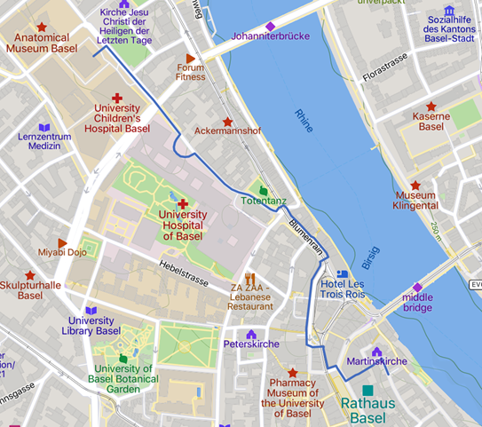

# Apero

### Monday, September 4th, 18:00-20:00 {.unlisted .unnumbered}
The apero with the choice of tasting some wines on Monday will take place at Biozentrum (the conference venue) in front of the lecture halls.

# Townhall reception 

### Tuesday, September 5th, 18:00-20:00 {.unlisted .unnumbered}
The reception will take place at the city archives behind the parliament building (Rathaus). The address is Martinsgasse 2.

See the map below for information on how to get there from the conference venue. It’s approximately a 20-minute walk.  
  
© OpenStreetMap, Mapbox and Mapcarta
 
 

# Excursion

### Wednesday, September 6th, 15:00-18:30 {.unlisted .unnumbered}
<b>Departure:</b> We will depart in buses from the conference venue to the Vitra Campus in Weil am Rhein (Germany) at 15:00. If you want to go to the Vitra Campus by yourself, you can find a travel description [at this link](https://www.design-museum.de/fileadmin/user_upload/Redaktion/als_pdf/Anfahrtsbeschreibung_Vitra_Campus_EN_VDM.pdf). In this case, please make sure that you arrive at Vitra before 15:30.

<b>Walk:</b> We will walk the [Rehberger-Weg](https://www.24stops.info/en/intro/). The Rehberger-Weg, which is around five kilometers long, links two countries, two municipalities, two cultural institutions – and countless stories. The path runs between Weil am Rhein and Riehen, between the [Vitra Campus](https://www.design-museum.de/en/information.html) and the [Fondation Beyeler](https://www.fondationbeyeler.ch/en/home). The walk will end at the restaurant of the conference dinner.

<b>Equipment:</b> During the walks the national border is crossed. Please <b>carry an identity card, a water bottle and wear sturdy shoes!</b> We recommend that you download the <b>Multimedia Guide “24 Stops”</b> on your mobile which is available on [Google Play (for Android devices)](https://play.google.com/store/apps/details?id=ch.fondationbeyeler.rehbergerweg&hl=de) and on the [Apple App store](https://apps.apple.com/ca/app/24-stops/id1116088034).
 
 

# Conference dinner

### Wednesday, September 6th, from 18:30 {.unlisted .unnumbered}
The conference dinner is at the [Restaurant Landgasthof Riehen](https://www.basel.com/en/restaurants-nightlife/landgasthof-riehen-52492bae9b), Baselstrasse 38, 4125 Riehen ([google maps link](https://www.google.com/maps/place/Landgasthof+Riehen/@47.5843449,7.6497924,15z/data=!4m9!3m8!1s0x4791b74c4a3eec65:0x116320e5c1fd33e7!5m2!4m1!1i2!8m2!3d47.5843449!4d7.6497924!16s%2Fg%2F1tdb_kqp?entry=ttu)). 

#### Public transport to and from the restaurant

If you do not join the conference excursion, you can reach the restaurant via Tram 6 (direction “Riehen Grenze”) from several central locations in Basel (e.g. Barfüsserplatz, Marktplatz, Claraplatz, or Messe; departures every 8 minutes)  in 15-25 minutes. Depart from the tram at “Riehen Dorf” and walk for 80 meters (the restaurant is on the same street as the tramline). 

To return to your hotel after the conference dinner, you can again use Tram 6 (from tram stop “Riehen Dorf”, direction “Allschwil Dorf”). The tram stop is close to the restaurant and trams run every 8 minutes until 22:59 and thereafter every 15 minutes. It stops at several central locations in Basel. 
  