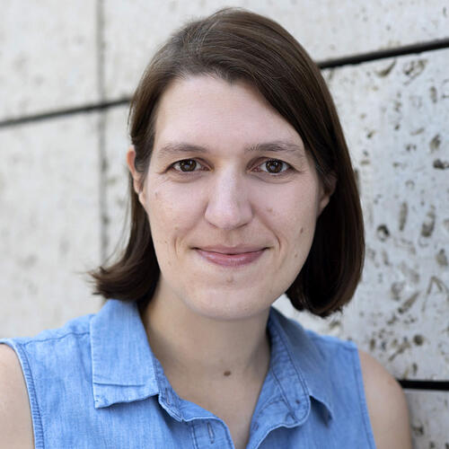
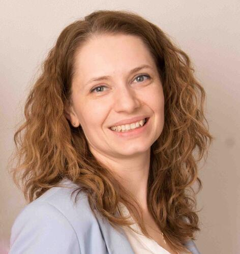
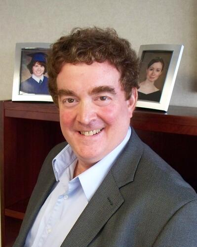
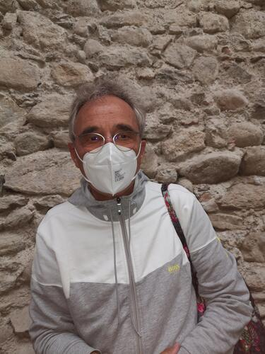
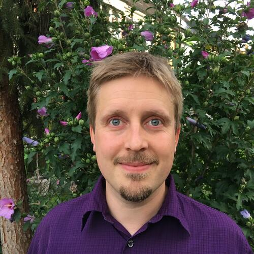
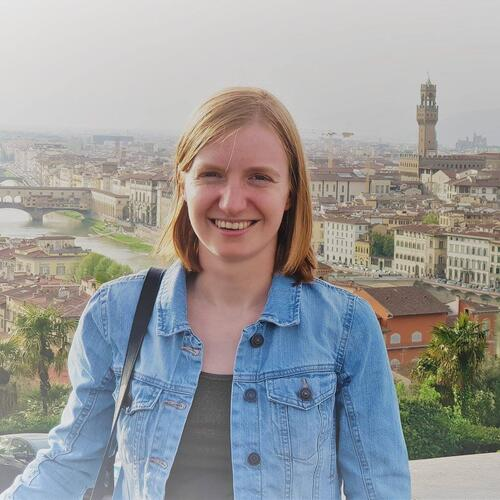
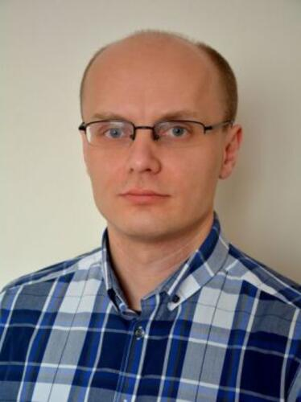

# Keynote Speakers

## Peter Bühlmann

Peter Bühlmann studied mathematics at ETH Zürich and received his doctoral degree in 1993 from the same institution. He was a Postdoctoral Fellow from 1994-1995 and a Neyman Assistant Professor from 1995 - 1997 at UC Berkeley, before he returned to ETH Zürich in 1997. From 2013 - 2017, he was Chair of the Department of Mathematics at ETH Zürich. He is a Fellow of the Institute of Mathematical Statistics, a Fellow of the American Statistical Association, and was Co-Editor of the Annals of Statistics from 2010 - 2012. Other honors which he recently received include Doctor Honoris Causa from the Université Catholique de Louvain in 2017, Neyman Lecturer 2018 elected by the Institute of Mathematical Statistics, Rothschild Lecturer 2018 at the Newton Institute (Cambridge), recipient of the Guy Medal in Silver 2018 from the Royal Statistical Society, and plenary speaker at the European Congress of Mathematics 2021.

[Keynote recording is now available on YouTube](https://www.youtube.com/watch?v=Q--viy-sNG8)

 
 

## Ruth Keogh

Ruth Keogh is a Professor of Biostatistics and Epidemiology in the Medical Statistics Department at London School of Hygiene & Tropical Medicine. Her research focuses on statistical methods for the analysis of observational data, and she works especially on causal inference methodology and methods for the analysis of time-to-event data. She is particularly interested in addressing practical challenges arising in real applications and is involved in a number of areas of application in health research, with a particular focus on cystic fibrosis. Other areas of interest include methods for handling measurement error and missing data, prediction modelling, and design and analysis of case-control studies. Ruth is funded by a UK Research and Innovation Future Leaders Fellowship.

[Keynote recording is now available on YouTube](https://www.youtube.com/watch?v=HyTXI9hdyZM)

 
 

## Alicja Szabelska-Beręsewicz

Alicja Szabelska-Beręsewicz is an Adjunct Professor in the Department of Mathematical and Statistical Methods at Poznan University of Life Sciences. She gained her experience during research internships in Zurich, Williamsburg and a one-year Sciex.ch grant stay at the Functional Genomic Center Zurich. Her research focuses on the development of various statistical methods that can be applied to biological and medical issues connected to next-generation sequencing (NGS) experiments. In particular, the fields of interest are regression models and testing procedures applied to differential expression analysis, biodiversity of microbiomes, or detection of alternative splicing phenomena. She is collaborating with other scientists in many interdisciplinary projects concerning real-life issues that include the NGS data analysis. 

[Keynote recording is now available on YouTube](https://www.youtube.com/watch?v=N0tX61NYnpM)

 
 
 

# Banquet Speaker

## Stephen Senn

Stephen Senn has worked as a statistician but also as an academic in various positions in Switzerland, Scotland, England, France and Luxembourg. From 2011-2018 he was head of the Competence Center for Methodology and Statistics at the Luxembourg Institute of Health. He is the author of Cross-over Trials in Clinical Research (1993, 2002), Statistical Issues in Drug Development (1997, 2007,2021) & Dicing with Death (2003, 2022). In 2009 was awarded the Bradford Hill Medal of the Royal Statistical Society. In 2017 he gave the Fisher Memorial Lecture. He is an honorary life member of PSI and ISCB.

 
 
 

# Invited Speakers

## Robert A. Beckman
**Lombardi Comprehensive Cancer Center, and Innovation Center for Biomedical Informatics, Georgetown University Medical Center, USA**  
 
**Keywords**: Development efficiency, predictive biomarkers, basket trials, informational design, non-concurrent controls  
 

## Marc Buyse
**International Drug Development Institute (IDDI), Louvain-la-Neuve, Belgium, and I-BioStat, Hasselt University, Belgium**  
 
**Keywords**: Generalized Pairwise Comparisons, Net Treatment Benefit, Win Ratio, Success Odds
 

## Vanessa Didelez
**Leibniz Institute for Prevention Research and Epidemiology - BIPS, Bremen, Germany**  
 
**Keywords**: causal inference, observational / real-world data, estimands, target trial emulation, g-methods
 

<!--  -->

<!-- ## Ruben van Eijk -->
<!-- **University Medical Center Utrecht, The Netherlands**   -->
<!--   -->
<!-- **Keywords**: Amyotrophic Lateral Sclerosis, Hybrid Design, Registry, External Control, Real World Data -->
<!--   -->

## Ludwig Hothorn
**Leibniz University Hannover, Germany**  
 
**Keywords:** Minimum effective dose; variance heterogeneity; robust alternatives
 

## H.&nbsp;M. James Hung
**US Food and Drug Administration, USA**  
 
**Keywords**: multiplicity, multiple endpoints, overall type I error  
 

## Florian Klinglmüller
**Austrian Agency for Health & Food Safety, Austria**  
 
**Keywords**: Survival analysis, non-proportional hazards, drug regulation
 

## Jack Kuipers
**ETH Zürich, Basel, Switzerland**  
 
**Keywords**: Causal discovery, Causal inference, Structure learning, Bayesian networks  

 

## Kelly Van Lancker
**Ghent University, Belgium**  
 
**Keywords**: covariate adjustment, causal inference, standardization, treatment policy, robustness  
 

## David Robertson
**University of Cambridge, UK**  
 
**Keywords**: Multiple testing, online hypothesis testing, platform trial, type I error rate  
 

## Łukasz Smaga
**Adam Mickiewicz University in Poznan, Poland**  
 
**Keywords**: Analysis of variance, functional data analysis, parametric and nonparametric methods  
 

## Jessica Young
**Harvard Medical School and Harvard Pilgrim Health Care Institute, USA**  
 
**Keywords**: causal inference, longitudinal data, survival analysis, competing events
 